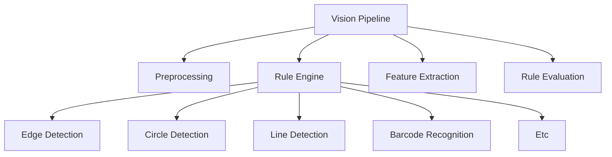

🇺🇸 <a href="README_eng.md">English</a> |
🇰🇷 <a href="README.md">한국어</a>

  

#  GUERNSEY (BISON Rule Inspection Engine) 

**High-Performance Industrial Rule-Based Vision Engine**

BISON Rule Inspection Engine은 산업용 머신비전 검사 시스템을 위해 설계된  
고성능 **C++ 기반 룰 검사 엔진**입니다.

Subpixel Edge Localization, Hough-based Circle and Line Detection,
Least-Squares Geometric Fitting, Precision Metrology,
Industrial Barcode Decoding 등 핵심 머신비전 알고리즘을 **고속 검사 파이프라인**으로 통합하여  
**고속 생산라인 환경에서도 안정적인 실시간 검사 성능**을 제공합니다.

본 엔진은 **Linux 기반 Edge Vision 장비** 와  
**Windows 기반 PC Vision 시스템**에서 동일한 검사 로직을 사용할 수 있도록 설계되었습니다.

하나의 검사 엔진으로 **Edge Vision 장비와 PC Vision 시스템을 동시에 지원**합니다.

---

# 🧠Industrial Rule Inspection Engine

산업용 검사 환경에서는 다음과 같은 특성이 중요합니다.

- Deterministic Inspection
- Real-Time Processing
- Stable System Operation
- High-Speed Image Processing

BISON Rule Inspection Engine은 이러한 요구사항을 충족하기 위해  
**산업용 검사 시스템에 특화된 Rule Inspection Architecture**로 설계되었습니다.

AI 기반 검사와 달리 룰 기반 검사는 다음과 같은 장점을 제공합니다.

- **예측 가능한 검사 결과**
- **빠른 처리 속도**
- **설명 가능한 검사 로직**
- **장기간 안정적인 운영**

이러한 특성 때문에 룰 기반 검사는 여전히 **산업용 생산라인 검사 시스템의 핵심 기술**로 사용됩니다.

---

# 📘Supported Inspection Algorithms

BISON Rule Inspection Engine은 다음과 같은 핵심 검사 알고리즘을 제공합니다.

| Category | Algorithms |
|---|---|
| Edge Extraction | Canny Edge Detector, Subpixel Edge Localization ... |
| Geometric Detection | Hough Circle Transform, Hough Line Transform ...|
| Geometric Fitting | Least Squares Line Fit, Circle Fit, Arc Fit ... |
| Blob Analysis | Connected Component Labeling, Blob Feature Extraction ... |
| Precision Measurement | Distance Measurement, Angle Measurement, Gap / Offset Measurement ... |
| Shape Matching | Shape-Based Matching, Template Matching (NCC) ... |
| Pattern Recognition | 1D Barcode Decoding, Pattern Detection ... |
| Image Enhancement | Adaptive Thresholding, Morphological Filtering ... |
| Contour Processing | Contour Extraction, Shape Descriptor Analysis ... |

모든 알고리즘은 **고속 산업용 검사 환경을 고려하여 최적화된 C++ 코드**로 구현되어 있습니다.

---

# ⚙️Cross Platform Vision Engine

BISON 검사 엔진은 **멀티 플랫폼 환경에서 동일한 검사 로직을 사용할 수 있도록 설계되었습니다.**

| Platform | Support |
|---|---|
| Windows(PC) Vision System | ✔ |
| Linux(Edge) Vision System | ✔ |

이 구조를 통해 다음과 같은 검사 시스템 구성이 가능합니다.

- Window(PC) Vision Inspection System
- Linux(Edge) Vision Inspection Device
- Inline Production Inspection System
- Smart Factory Vision Inspection

하나의 검사 엔진으로 **PC Vision + Edge Vision 환경을 동시에 지원**할 수 있습니다.

---

# 🔄High-Speed Inspection Performance

BISON Rule Inspection Engine은 고속 생산라인 환경에서도  
안정적인 검사 성능을 제공하도록 설계되었습니다.

| Inspection Type | Processing Time |
|---|---|
| Edge + Geometry Inspection | ~1–3 ms |
| Barcode Detection | ~2–5 ms |
| Full Inspection Pipeline | ~5–10 ms |

실제 생산라인 환경에서도 **실시간 검사 성능을 유지하도록 최적화**되었습니다.

---

# 🧩Inspection Pipeline

BISON Rule Inspection Engine은 다음과 같은 산업 분야에서 사용할 수 있습니다.

- 자동차 부품 검사
- 스마트팩토리 검사 시스템
- 인라인 생산 검사
- Edge Vision 검사 장비
- 고속 품질 검사 장비

------------------------------------------------------------------------

# Repository Scope

이 저장소는 Rule Inspection Engine 구조와 예제 컴포넌트를 제공합니다.

실제 상용 검사 알고리즘은 포함되어 있지 않습니다.

------------------------------------------------------------------------

# BISON AI Vision Lab

스마트 제조를 위한 산업용 Rule 검사 기술
